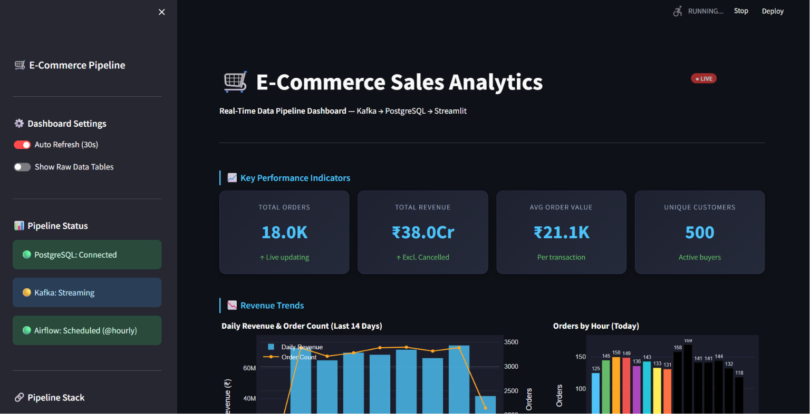
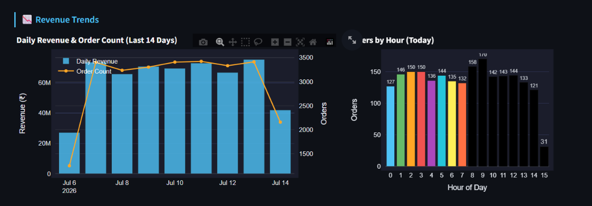
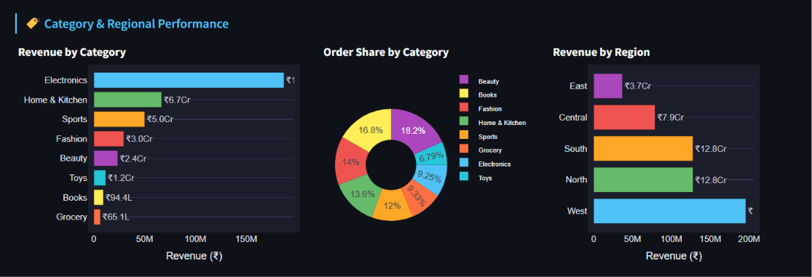
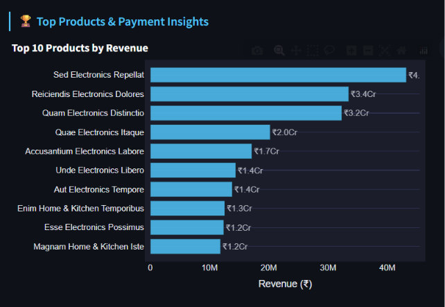
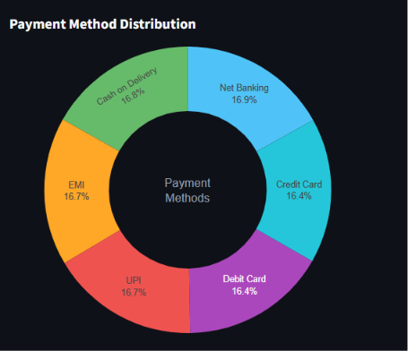
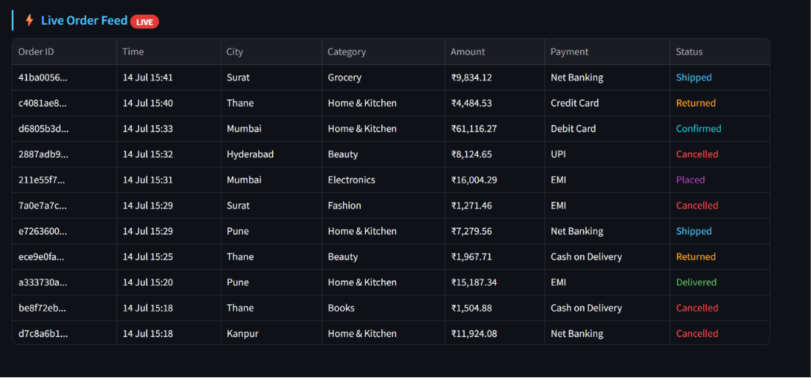

<div align="center">

# 🛒 E-Commerce Sales Data Pipeline

### Real-Time Data Engineering Pipeline

[](https://python.org)
[](https://kafka.apache.org)
[](https://postgresql.org)
[](https://airflow.apache.org)
[](https://streamlit.io)
[](https://docker.com)
[](https://pandas.pydata.org)

**End-to-end real-time data pipeline that simulates, streams, transforms, stores, orchestrates and visualizes Indian e-commerce sales data.**

[Features](#-features) • [Architecture](#-architecture) • [Tech Stack](#-tech-stack) • [Setup](#-setup--installation) • [Screenshots](#-dashboard-screenshots)

</div>

---

## 📸 Dashboard Screenshots

### 🏠 Main Dashboard — KPIs & Overview


> **18K+ orders** · **₹38 Crore revenue** · **₹21.1K avg order value** · **500 unique customers** — all updating live every 30 seconds

---

### 📉 Revenue Trends & Hourly Pattern


> Daily revenue bar chart (last 14 days) with order count overlay + hourly order distribution for today

---

### 🏷️ Category & Regional Performance


> Electronics leads revenue · West region dominates · Order share by category (donut) · Regional breakdown (bar)

---

### 🏆 Top Products by Revenue


> Top 10 products ranked by total revenue — Electronics dominates the top 9 positions

---

### 💳 Payment Method Distribution


> Even distribution across UPI (16.7%), Net Banking (16.9%), Credit Card (16.4%), Debit Card (16.4%), EMI (16.7%), COD (16.8%)

---

### ⚡ Live Order Feed


> Real-time order stream with color-coded statuses — Shipped (blue), Delivered (green), Cancelled (red), Returned (orange)

---

## ✨ Features

- 🎲 **Fake Data Generation** — 500 customers, 100 products, 20 stores using Faker with Indian locale
- 📨 **Real-Time Streaming** — 50 orders every 10 seconds via Apache Kafka
- 🐼 **Data Transformation** — Pandas-based validation, cleaning and enrichment layer
- 🗄️ **Relational Storage** — PostgreSQL with 5 tables, 5 analytics views, 12 indexes
- 🌬️ **Pipeline Orchestration** — 7-task Apache Airflow DAG running hourly
- 📊 **Live Dashboard** — 9-section Streamlit dashboard with Plotly charts
- 🇮🇳 **Indian Domain** — GST calculation, UPI payments, Indian cities and regions
- 🐳 **One-Command Setup** — Docker Compose starts Kafka + Zookeeper + PostgreSQL

---

## 🏗️ Architecture

```
┌─────────────────────────────────────────────────────────────────┐
│                      DATA PIPELINE FLOW                          │
├─────────────────────────────────────────────────────────────────┤
│                                                                  │
│  🎲 Faker Generator                                              │
│  500 customers · 100 products · 20 stores · ∞ orders            │
│            │                                                     │
│            ▼                                                     │
│  📨 Kafka Producer                                               │
│  50 orders/batch · every 10 seconds · Topic: ecommerce_orders   │
│            │                                                     │
│            ▼                                                     │
│  📨 Kafka Broker + Zookeeper (Docker)                            │
│  Message storage · Partition management · Offset tracking        │
│            │                                                     │
│            ▼                                                     │
│  📨 Kafka Consumer                                               │
│  Poll every 1s · Manual commit after DB insert                   │
│            │                                                     │
│            ▼                                                     │
│  🐼 Pandas Transformer                                           │
│  Validate · Clean · Deduplicate · Enrich · Reject bad data      │
│            │                                                     │
│            ▼                                                     │
│  🗄️ PostgreSQL                                                   │
│  customers · products · stores · orders · daily_summary          │
│  5 views · 12 indexes · UPSERT idempotency                      │
│            │                                                     │
│            ▼                                                     │
│  🌬️ Apache Airflow (DAG — @hourly)                               │
│  health checks → kafka ETL → DQ checks → daily summary          │
│            │                                                     │
│            ▼                                                     │
│  📊 Streamlit Dashboard                                          │
│  KPIs · Revenue · Categories · Regions · Products · Live Feed   │
│                                                                  │
└─────────────────────────────────────────────────────────────────┘
```

---

## 🛠️ Tech Stack

| Layer | Technology | Version | Purpose |
|---|---|---|---|
| **Data Generation** | Python · Faker | 3.10+ · 24.2 | Simulate Indian e-commerce data |
| **Message Streaming** | Apache Kafka · Zookeeper | 7.4.0 | Real-time event streaming |
| **Transformation** | Pandas · NumPy | 2.2.1 | Clean, validate, enrich data |
| **Storage** | PostgreSQL | 15 | Relational data warehouse |
| **Orchestration** | Apache Airflow | 2.8.4 | Schedule & monitor pipeline |
| **Visualization** | Streamlit · Plotly | 1.32.2 | Interactive live dashboard |
| **Infrastructure** | Docker · Docker Compose | Latest | Containerized services |

---

## 📁 Project Structure

```
ecommerce-pipeline/
│
├── 📁 config/
│   └── config.py                 ← Central config (DB, Kafka, settings)
│
├── 📁 data_generator/
│   ├── faker_generator.py        ← Generates customers, products, orders
│   └── __init__.py
│
├── 📁 kafka/
│   ├── producer.py               ← Streams orders to Kafka topic
│   ├── consumer.py               ← Reads from Kafka, loads to PostgreSQL
│   └── __init__.py
│
├── 📁 transforms/
│   ├── transformer.py            ← Pandas validation & cleaning layer
│   └── __init__.py
│
├── 📁 database/
│   ├── schema.sql                ← PostgreSQL schema (5 tables + 5 views)
│   ├── db_connector.py           ← Connection pool & all DB queries
│   └── __init__.py
│
├── 📁 airflow/
│   ├── pipeline_dag.py           ← 7-task hourly Airflow DAG
│   └── setup_airflow.sh          ← One-time Airflow setup script
│
├── 📁 dashboard/
│   └── app.py                    ← 9-section Streamlit dashboard
│
├── 📁 assets/
│   └── images/                   ← Dashboard screenshots
│
├── docker-compose.yml            ← Kafka + Zookeeper + PostgreSQL
├── requirements.txt              ← All Python dependencies
├── run_pipeline.py               ← Verification script
└── README.md
```

---

## ⚙️ Setup & Installation

### Prerequisites

| Tool | Version | Download |
|---|---|---|
| Python | 3.10+ | https://python.org |
| Docker Desktop | Latest | https://docker.com/products/docker-desktop |
| Git | Latest | https://git-scm.com |

---

### Step 1 — Clone Repository

```bash
git clone https://github.com/jaymin-2901/ecommerce-pipeline.git
cd ecommerce-pipeline
```


---

### Step 2 — Create Virtual Environment

```bash
# Create
python -m venv venv

# Activate (Windows CMD)
venv\Scripts\activate

# Activate (Windows PowerShell)
venv\Scripts\Activate.ps1

# Activate (Mac/Linux)
source venv/bin/activate
```

---

### Step 3 — Install Dependencies

```bash
python -m pip install -r requirements.txt
```

---

### Step 4 — Start Docker Services

```bash
# Start Kafka + Zookeeper + PostgreSQL
docker-compose up -d

# Verify all 3 containers running
docker ps
```

Expected output:
```
CONTAINER ID   IMAGE                             STATUS
xxxxxxxxxxxx   confluentinc/cp-kafka:7.4.0       Up 30 seconds
xxxxxxxxxxxx   confluentinc/cp-zookeeper:7.4.0   Up 30 seconds
xxxxxxxxxxxx   postgres:15                        Up 30 seconds
```

---

### Step 5 — Verify Everything Works

```bash
python run_pipeline.py
```

Expected output:
```
✅ All Python imports OK
✅ Docker containers running (kafka, zookeeper, postgres)
✅ PostgreSQL connected — 5 tables, 5 views
✅ Kafka broker reachable
✅ Faker generator — 500 customers, 100 products, 20 stores
✅ Transformer — 50 valid orders, 0 invalid
✅ Full integration test PASSED
```

---

### Step 6 — Run the Pipeline (3 Terminals)

**Terminal 1 — Start Producer**
```bash
python kafka/producer.py
```
```
📤 Batch #0001 | Sent: 50 orders | Total: 50    | 15:30:00
📤 Batch #0002 | Sent: 50 orders | Total: 100   | 15:30:10
📤 Batch #0003 | Sent: 50 orders | Total: 150   | 15:30:20
```

**Terminal 2 — Start Consumer**
```bash
python kafka/consumer.py
```
```
📥 Poll #0001 | Consumed: 50 | Inserted: 50 | Total: 50
📥 Poll #0002 | Consumed: 50 | Inserted: 50 | Total: 100
📥 Poll #0003 | Consumed: 50 | Inserted: 50 | Total: 150
```

**Terminal 3 — Start Dashboard**
```bash
streamlit run dashboard/app.py
```
```
Local URL: http://localhost:8501
```

---

### Step 7 — Verify Data in PostgreSQL

```bash
docker exec -it postgres_ecommerce psql -U postgres -d ecommerce_db
```

```sql
-- Total orders (grows every 10 seconds)
SELECT COUNT(*) FROM orders;

-- Revenue by category
SELECT * FROM vw_revenue_by_category;

-- Recent 5 orders
SELECT order_id, category, final_amount, order_status
FROM orders ORDER BY ingested_at DESC LIMIT 5;
```

---

### Step 8 — Setup Airflow (Optional)

```bash
# WSL / Linux / Mac only
pip install apache-airflow==2.8.4

export AIRFLOW_HOME=$(pwd)/airflow_home
airflow db init

airflow users create \
    --username admin --password admin123 \
    --firstname Jaymin --lastname Chavda \
    --role Admin --email jaymin29chavda@gmail.com

mkdir -p airflow_home/dags
cp airflow/pipeline_dag.py airflow_home/dags/

airflow standalone
```

Open **http://localhost:8080** (admin / admin123)
Enable DAG: `ecommerce_pipeline_dag`

---

## 🛑 Stop Everything

```bash
# Stop terminals with Ctrl+C, then:
docker-compose down

# Full reset (deletes all data)
docker-compose down -v
```

---

## 📊 Pipeline Metrics

| Metric | Value |
|---|---|
| Orders per batch | 50 |
| Batch interval | 10 seconds |
| Orders per minute | ~300 |
| Master data — Customers | 500 |
| Master data — Products | 100 |
| Master data — Stores | 20 |
| PostgreSQL tables | 5 |
| PostgreSQL views | 5 |
| PostgreSQL indexes | 12 |
| Airflow DAG tasks | 7 |
| Dashboard sections | 9 |
| Dashboard refresh | 30 seconds |

---

## 🐛 Common Issues & Fixes

**Issue: `pip` not recognized**
```bash
python -m pip install -r requirements.txt
```

**Issue: Kafka connection refused**
```bash
# Wait 30 seconds after docker-compose up, then retry
docker-compose down && docker-compose up -d
```

**Issue: PostgreSQL auth failed**
```bash
# Password is postgres123 — check docker-compose.yml
docker exec -it postgres_ecommerce psql -U postgres -d ecommerce_db
```

**Issue: Dashboard shows no data**
```
Make sure producer.py and consumer.py are running first
```

**Issue: Port already in use**
```bash
# Windows — find and kill process on port 9092
netstat -ano | findstr :9092
taskkill /PID <PID> /F
```

---


## 👨‍💻 Author

**Jaymin Chavda**

B.E. Computer Science (Data Science) — VGEC, Ahmedabad

[](mailto:jaymin29chavda@gmail.com)
[](https://linkedin.com/in/jaymin-chavda)
[](https://github.com/jaymin-2901)

---

## 📄 License

MIT License — Free to use, modify, and distribute.

---

<div align="center">

**Built with ❤️ using Faker · Kafka · Pandas · PostgreSQL · Airflow · Streamlit**

⭐ Star this repo if it helped you!

</div>
